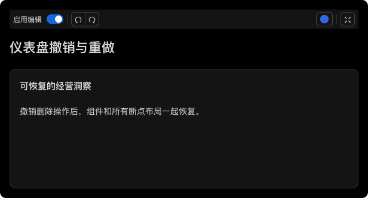

# Dashboard Undo and Complete API Generation

## Context

Dashboard already exposed the Chart builder's `UndoManager` wrapper. However,
widget insertion used multiple transactions, adjacent edits merged for 500 ms,
remote updates with no origin could enter history, and layout writes replaced the
entire layout object. The generated Dashboard API omitted the undo manager page
and unresolved source imports produced `any` for synchronization methods.

## Decision

- Keep one shared UndoManager implementation for Chart, Insight and Dashboard.
  It wraps Yjs history rather than maintaining JSON snapshots. Only local
  transactions are captured, even when a remote provider supplies no origin.
  Default tracked origins remain `null`; callers can configure or update the set.
- Dashboard and Chart use `captureTimeout: 0`, so each transaction is an independent
  action. Insight retains its existing 500 ms default. Dashboard `transact` and
  Chart `doc.transact` group synchronous edits; `stopCapturing` separates actions when a
  nonzero capture window is configured. Yjs transactions do not roll back thrown
  callbacks, so callers should validate inputs before mutating.
- Insert the widget, run its callback and write all breakpoint layouts in one
  transaction. Updates and removals also change widget and layout together.
- Normalize persisted JSON layouts into `Y.Map<Y.Array<Y.Map>>` before attaching
  history. Preserve layout IDs and update only changed fields. Concurrent edits
  to other widgets or other fields of the same layout survive local undo.
  `build()` still exports the existing JSON DSL shape. Existing nested Yjs
  layouts are retained, rather than recreated during builder attachment.
- Widget references do not transfer ownership: referenced Chart and Insight
  documents keep their own undo histories. Dashboard history is local and is not
  serialized; the document changes caused by undo/redo synchronize normally.
- Provide history observation, origin management, capture boundaries and disposal
  through the shared wrapper. Destroying the owning Y.Doc also disposes history.
- Generate Dashboard, theme, chart/insight collections and nodes, undo manager,
  constructor dependencies and options from their TypeScript declarations.
  Load the actual package tsconfig to resolve return types. Missing Dashboard
  feature sections or class symbols fail generation instead of silently omitting
  API pages. A test generates into a temporary directory and checks the complete
  navigation and public methods. Internal `getLayouts` is excluded from public API.

Yjs behavior follows the official [UndoManager](https://docs.yjs.dev/api/undo-manager)
and [transaction](https://docs.yjs.dev/api/y.doc) APIs.

## Usage

```ts
const dashboard = vbi.dashboard.create(vbi.dashboard.createEmpty())
const unsubscribe = dashboard.undoManager.observe(() => {
  updateButtons(dashboard.undoManager.canUndo(), dashboard.undoManager.canRedo())
})

dashboard.transact(() => {
  dashboard.theme.setTheme('dark')
  dashboard.insight.add((widget) => widget.setInsightId(insightBuilder).setLayouts({ lg: { x: 0, y: 0, w: 8, h: 4 } }))
})
dashboard.undoManager.undo()
dashboard.undoManager.redo()
unsubscribe()
```

## Compatibility

JSON snapshots remain portable. Live collaborators should use the same builder
version: older clients replace the entire layout with a plain object, which does
not preserve the new per-field merge semantics. `setLayouts` submits layout input
inside collection `add` / `update` callbacks; it is not a standalone layout setter.
Metadata retains its existing object representation and conflict granularity.
Peers should clone an existing Yjs document/update before editing together, rather
than independently constructing different documents from the same JSON snapshot.

## Validation — 2026-09-23

- `pnpm --filter @visactor/vbi run g`: generated tests, examples and all four API
  sections successfully. The new Dashboard undo example is included. Reviewed
  snapshot changes reflect stable layout IDs and the resulting deterministic ID
  sequence, not changes to widget content or layout coordinates.
- VBI full coverage: 146 tests in 26 files pass; statements, branches, functions
  and lines remain **100% → 100%**. Tests cover two-document synchronization,
  concurrent field updates, peer insertions, remote overwrites, atomic layout
  restoration, explicit transaction grouping, origins, observers and disposal.
- VBI React and VBI Component generation succeeded, including all eight localized
  Storybooks; complete coverage suites ran again after generation.
- All 11 affected workspaces passed their complete test/coverage suites: 425 tests
  total. VBI Agent, Website and practices have no `g` script. Website coverage
  covers its demo connector; the starter's existing single test still provides
  0% source coverage and is not a complete UI test.
- VBI ESM, CommonJS and declaration builds passed. Root typecheck passed all
  25 tasks (19 executed, 6 unchanged tasks cached).
- Root lint, format and Git whitespace checks passed. Website production build
  passed for all languages, including server/client bundles and static rendering;
  all 352 copied Storybook files match the final generated assets. An initial
  overlapping dev/build attempt could not resolve the Playground virtual module;
  rebuilding after stopping the acceptance dev server succeeded without source changes.
- Website browser acceptance used `http://127.0.0.1:4174/VBI/`: home page, all seven
  Dashboard API pages, the generated Dashboard undo example and Playground.
  In Playground, adding an insight widget and switching theme in one transaction,
  then clicking Undo and Redo, restored both rendered content and theme. History
  button enabled/disabled states updated through `undoManager.observe`. No
  uncaught page errors occurred. The temporary development server was stopped.

Coverage percentages (statements / branches / functions / lines):

| Workspace             | Tests | Coverage                      |
| --------------------- | ----: | ----------------------------- |
| vbi                   |   146 | 100 / 100 / 100 / 100         |
| vbi-agent             |     9 | 76.99 / 58.06 / 82.45 / 78.07 |
| vbi-react             |    17 | 95.30 / 90.42 / 93.54 / 95.30 |
| vbi-component         |   114 | 32.28 / 22.27 / 30.69 / 33.96 |
| dashboard             |    22 | 97.74 / 85.18 / 97.01 / 99.35 |
| standard              |    65 | 48.15 / 30.22 / 42.97 / 46.23 |
| minimalist            |     5 | 13.61 / 12.91 / 7.63 / 13.44  |
| streamlined           |     9 | 18.14 / 12.69 / 13.95 / 17.98 |
| professional          |    34 | 59.32 / 37.82 / 47.38 / 59.31 |
| vbi-react-starter     |     1 | 0 / 0 / 0 / 0                 |
| website demoConnector |     3 | 96 / 75 / 85.71 / 95.65       |

Fresh HTML reports are in each workspace's `coverage/index.html`; JSON summaries
are in `coverage/coverage-summary.json`. VBI Component provides
`coverage/coverage-final.json` and the terminal summary instead.
VSeed and VQuery source, configuration and coverage thresholds are unchanged.

## Toolbar and chart history follow-up

Dashboard's default toolbar now exposes undo and redo through the Builder's history
subscription. Controls follow programmatic operations, history clearing and Builder
replacement, release subscriptions on unmount, hide in view mode and disable when
editing is off. Eight locales provide accessible labels and tooltips. Standalone
`DashboardUndoButton` and `DashboardRedoButton` support custom toolbar composition.

The toolbar follows Standard's compact appearance: small outlined buttons, joined
history controls, thin dividers, and separate editing and presentation groups.
Theme menus and tooltips remain inside the dashboard during fullscreen.



Chart history also separates consecutive synchronous transactions. Adding a node
with its callback remains one step; explicit `doc.transact` groups multiple edits.
The regression tests exercise the chart instance resolved through a dashboard.
API comments and the undo example were regenerated with VBI's `g` script.

Final coverage runs pass 148 VBI, 26 Dashboard and 65 Standard tests. VBI retains
100% in all four metrics. Dashboard improves to 97.92 / 86.62 / 97.36 / 99.41;
the history buttons have 100% in all four metrics. Website's three tests also pass
with 96 / 75 / 85.71 / 95.65 coverage. Root typecheck and lint pass.

Browser acceptance on the existing `http://localhost:3000/VBI/` service covers the
home page, dashboard and chart undo examples, and Playground. Verified individual
chart undo/redo steps, grouped dashboard edits, toolbar availability, history
clearing, view mode, light/dark themes, fullscreen menus and a 375px viewport with
no browser errors. The user's development server remains running.
